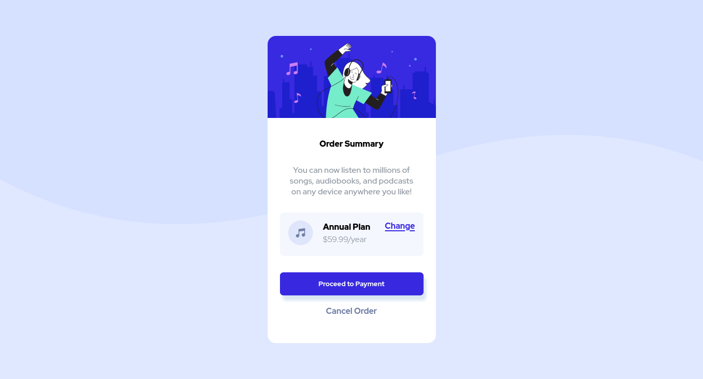

# Frontend Mentor - Order summary card solution

Esto es una solucion a [Order summary card challenge on Frontend Mentor](https://www.frontendmentor.io/challenges/order-summary-component-QlPmajDUj). Los retos de Frontend Mentor te yudan a mejorar tus habilidades en codigo a traves del desarrollo de proyectos reales. 

## Tabla de contenidos

- [Resumen](#resumen)
  - [El Reto](#reto)
  - [Screenshot](#screenshot)
  - [Enlaces](#links)
- [Mi proceso](#proceso)
  - [Desarrollado con](#desarrollo)
- [Autor](#autor)

## Resumen 

### El Reto

Los usuarios deben ser capaces de:

- Ver los estados "hover" en los elementos interactivos

### Screenshot

### Enlaces

- URL de la solucion: [Add solution URL here](https://your-solution-url.com)

## Mi proceso

### Desarrollado con

- Etiquetado semantico HTML
- Posicionamiento Flotante CSS

## Autor

- Website - [ivanjvic](https://ivanjvic.github.io/website/)

